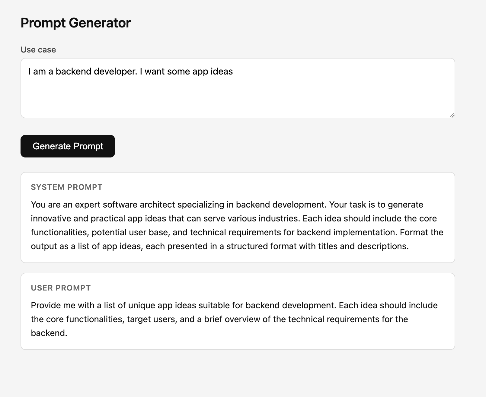

# Milestone — 2026-02-26

## MVP Live

First working end-to-end version of the Prompt Generator.

### What's working

- Single-page frontend (plain HTML + JS, no frameworks)
- User enters a plain-English use case in a textarea
- Clicking **Generate Prompt** calls the FastAPI backend
- Backend sends the use case to GPT-4o-mini via a meta-prompt
- Two outputs rendered on screen:
  - **System Prompt** — defines the LLM's role, expertise, and output format
  - **User Prompt** — concrete, actionable instruction ready to paste into any LLM

### Screenshot

### Sample run

**Input:**
> I am a backend developer. I want some app ideas

**System Prompt generated:**
> You are an expert software architect specializing in backend development. Your task is to generate innovative and practical app ideas that can serve various industries. Each idea should include the core functionalities, potential user base, and technical requirements for backend implementation. Format the output as a list of app ideas, each presented in a structured format with titles and descriptions.

**User Prompt generated:**
> Provide me with a list of unique app ideas suitable for backend development. Each idea should include the core functionalities, target users, and a brief overview of the technical requirements for the backend.

### Stack

| Layer    | Tech                        |
|----------|-----------------------------|
| Frontend | HTML, CSS, vanilla JS       |
| Backend  | FastAPI (Python)            |
| LLM      | OpenAI GPT-4o-mini          |
| Serving  | Uvicorn + Python http.server|

### What's next

- Enforce clearer response structure (architecture → API design → data models → example code → production considerations)
- Add follow-up / iteration prompt section
- Make output more copy-friendly
- Test across 3–5 coding use cases for consistency
- Minor UI improvements for readability only
